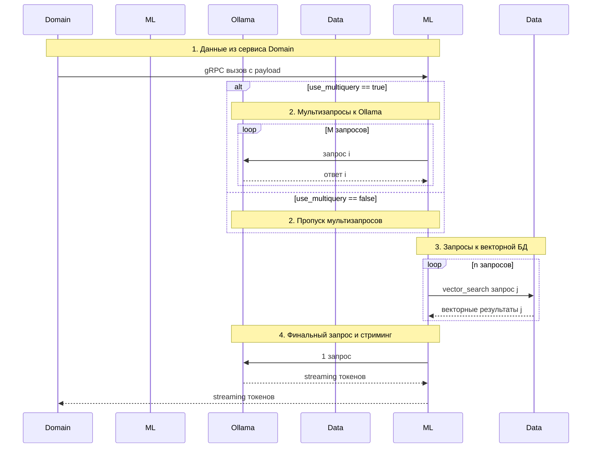

```mermaid
sequenceDiagram
    participant Domain
    participant MLService as ML
    participant Ollama
    participant DataService as Data

    Note over Domain,ML: 1. Данные из сервиса Domain  
    Domain->>ML: gRPC вызов с payload

    alt use_multiquery == true
        Note over ML,Ollama: 2. Мультизапросы к Ollama  
        loop M запросов
            ML->>Ollama: запрос i
            Ollama-->>ML: ответ i
        end
    else use_multiquery == false
        Note over ML,Ollama: 2. Пропуск мультизапросов
    end

    Note over ML,Data: 3. Запросы к векторной БД  
    loop n запросов
        ML->>Data: vector_search запрос j
        Data-->>ML: векторные результаты j
    end

    Note over ML,Ollama: 4. Финальный запрос и стриминг  
    ML->>Ollama: 1 запрос
    Ollama-->>ML: streaming токенов
    ML-->>Domain: streaming токенов
```